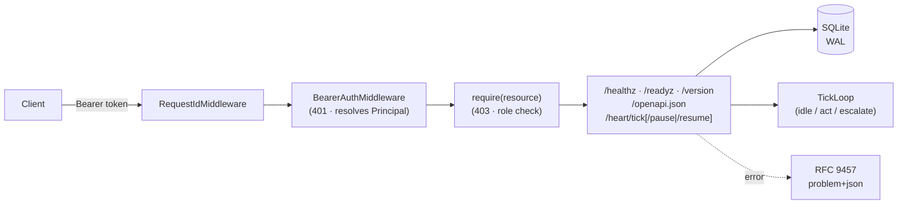

# 🫀 Ansina

[](https://github.com/giacchetta/ansina/actions/workflows/ci.yml)

> A self-owned AI agent: an always-on in-process **Heart** plus a remote **Brain**, exposed over a single internal REST API. No chat channels.

> **Status:** M1 in progress — HeartRuntime port + MLX adapter (issue #10) and the autonomic tick loop (issue #11) landed. See the [roadmap](docs/architecture/blueprint.md#4-roadmap).



## ⚡ Quick Start

```bash
make sync          # bootstraps uv if missing, installs dependencies
uv run ansina       # serves on http://127.0.0.1:8000
curl localhost:8000/healthz
```

First run prints a bootstrap Admin API token **once** — copy it now, it's never shown or stored in plaintext again:

```bash
uv run ansina        # look for the banner, then Ctrl-C
export TOKEN=<the token from the banner>
curl -H "Authorization: Bearer $TOKEN" localhost:8000/version
```

## 🔌 API

| Route | Auth | Min role | Purpose |
|---|---|---|---|
| `GET /healthz` | public | — | Liveness only — 200 unconditionally, never consults readiness. |
| `GET /readyz` | public | — | 200 `ready` with per-check booleans, or 503 `problem+json` if any check fails. |
| `GET /version` | token | Read | Name + version. |
| `GET /openapi.json` | token | Read | The OpenAPI contract document — no `/docs`/`/redoc` HTML viewer is served; point any external OpenAPI UI at a fetched copy of this JSON instead. |
| `GET /heart/tick` | token | Read | Tick loop status: running, paused, tick count, last decision. 503 `problem+json` if the Heart is disabled. |
| `POST /heart/tick/pause` | token | Write | Kill switch — halts future ticks without a process restart. |
| `POST /heart/tick/resume` | token | Write | Undoes `/heart/tick/pause`. |

`PUBLIC_PATHS` (`/healthz`, `/readyz`) is the only carve-out — every other route is deny-by-default at both layers: **authentication** (a valid bearer token identifying *some* user — 401 `problem+json`, `ansina.unauthorized`) and, per user role, **authorization** (that user's role holding a grant for this route's resource and HTTP verb — 403 `problem+json`, `ansina.forbidden`). Four fixed roles, increasing in scope: `Read` (GET only) → `Write` (+POST/PUT/PATCH) → `Maintain`/`Admin` (+DELETE and the RBAC management surface). A route with no `require(...)` authorization declaration fails to boot at all — the same "fail loudly before uvicorn binds a port" gate `HeartUnavailableError` uses — so a new endpoint can never ship ungated by accident.

Auth is enforced by default: on first boot Ansina generates and prints its own bootstrap API token, assigned the `Admin` role (or hashes an operator-supplied `ANSINA_SECURITY__API_TOKEN` instead, if one is set); a missing/wrong token gets a 401. `ANSINA_SECURITY__ENABLED=false` disables both authentication and authorization entirely (loopback-only) for local dev — `/version` then returns 200 without a token.

## ⚙️ Configuration

Precedence: built-in defaults → `ansina.toml` → `ANSINA_*` env vars. Secrets are env-only — setting `ANSINA_SECURITY__API_TOKEN` in `ansina.toml` is a hard startup error. See [`ansina.example.toml`](ansina.example.toml) for the full shape.

## 🫀 Heart runtime

The in-process Heart (`[heart] enabled`, off by default) currently runs on **MLX only — Apple Silicon**. Enable it:

```bash
uv sync --extra mlx
ANSINA_HEART__ENABLED=true uv run ansina
```

On any other host, enabling it fails loudly at boot rather than silently degrading — no fallback ships yet (a portable, non-Apple-Silicon adapter is tracked in a follow-up issue).

Once loaded, the Heart runs an autonomic tick loop (`[heart.tick]`, on by default whenever the Heart is): every `interval_seconds` (plus jitter) it decides idle/act/escalate and logs the decision. `act` and `escalate` are logged only for now — there's nothing to act on yet and no `BrainProvider` (issue #12) to escalate to. `GET /heart/tick` reports its state; `POST /heart/tick/pause` and `/resume` are the kill switch.

## 🛠️ Development

| Target | Runs |
|---|---|
| `make sync` | Install/sync dependencies via `uv` |
| `make check` | Everything CI runs: lint, format-check, mypy --strict, full test suite |
| `make test-unit` | Unit tests only |
| `make test-e2e` | Black-box E2E suite (real subprocess) |
| `make precommit` | Pre-commit hooks against all files |

## 📚 Docs

[`docs/architecture/blueprint.md`](docs/architecture/blueprint.md) — architecture rationale, the OpenClaw comparison this design departs from, and the full roadmap.
