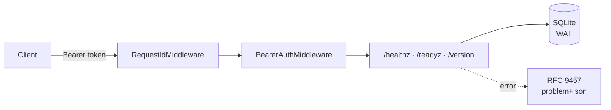

# 🫀 Ansina

[](https://github.com/giacchetta/ansina/actions/workflows/ci.yml)

> A self-owned AI agent: an always-on in-process **Heart** plus a remote **Brain**, exposed over a single internal REST API. No chat channels.

> **Status:** M1 in progress — HeartRuntime port + MLX adapter landed (issue #10). See the [roadmap](docs/architecture/blueprint.md#4-roadmap).



## ⚡ Quick Start

```bash
make sync          # bootstraps uv if missing, installs dependencies
uv run ansina       # serves on http://127.0.0.1:8000
curl localhost:8000/healthz
```

## 🔌 API

| Route | Auth | Purpose |
|---|---|---|
| `GET /healthz` | public | Liveness only — 200 unconditionally, never consults readiness. |
| `GET /readyz` | public | 200 `ready` with per-check booleans, or 503 `problem+json` if any check fails. |
| `GET /version` | token | Name + version. |

`PUBLIC_PATHS` (`/healthz`, `/readyz`) is the only carve-out — every other route is deny-by-default. In dev mode (no `ANSINA_SECURITY__API_TOKEN` set), auth is disabled entirely, so `/version` returns 200 without a token; once a token is configured, a missing/wrong one gets a 401 `problem+json`.

## ⚙️ Configuration

Precedence: built-in defaults → `ansina.toml` → `ANSINA_*` env vars. Secrets are env-only — setting `ANSINA_SECURITY__API_TOKEN` in `ansina.toml` is a hard startup error. See [`ansina.example.toml`](ansina.example.toml) for the full shape.

## 🫀 Heart runtime

The in-process Heart (`[heart] enabled`, off by default) currently runs on **MLX only — Apple Silicon**. Enable it:

```bash
uv sync --extra mlx
ANSINA_HEART__ENABLED=true uv run ansina
```

On any other host, enabling it fails loudly at boot rather than silently degrading — no fallback ships yet (a portable, non-Apple-Silicon adapter is tracked in a follow-up issue).

## 🛠️ Development

| Target | Runs |
|---|---|
| `make sync` | Install/sync dependencies via `uv` |
| `make check` | Everything CI runs: lint, format-check, mypy --strict, full test suite |
| `make test-unit` | Unit tests only |
| `make test-e2e` | Black-box E2E suite (real subprocess) |
| `make precommit` | Pre-commit hooks against all files |

## 📚 Docs

[`docs/architecture/blueprint.md`](docs/architecture/blueprint.md) — architecture rationale, the OpenClaw comparison this design departs from, and the full roadmap.
