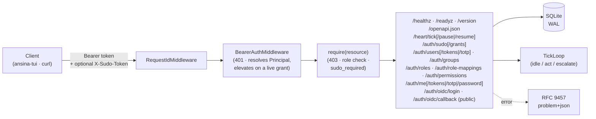
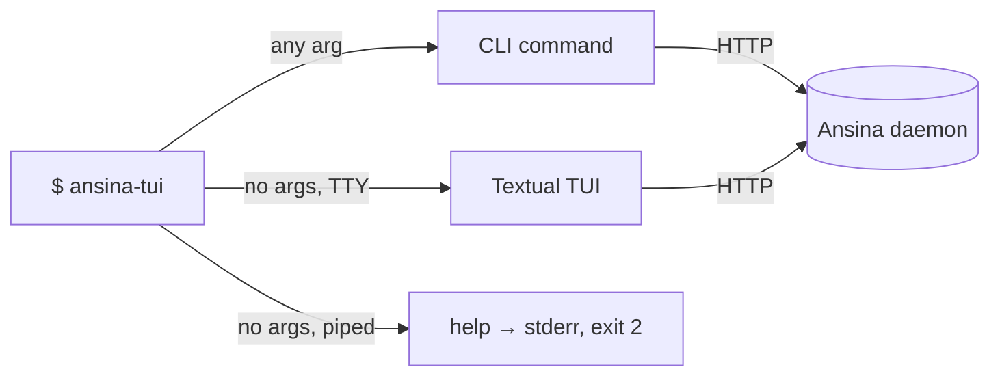

# 🫀 Ansina

[](https://github.com/giacchetta/ansina/actions/workflows/ci.yml)

> A self-owned AI agent: an always-on in-process **Heart** plus a remote **Brain**, exposed over a single internal REST API. No chat channels.

> **Status:** M3 — Custom Roles & Federated Identity complete (issues #37–#45, #47): admin-defined custom roles, the fail-closed sudo gate, TOTP step-up, role-mapping provenance, OAuth 2.0/OIDC federated login (`POST /auth/oidc/login` + `GET /auth/oidc/callback`), and `ansina-tui`'s multi-factor `auth sudo`/`auth totp` commands — see the [roadmap](docs/architecture/blueprint.md#4-roadmap). M4 (`ansina-tui`, issues #30, #28, #31–#35) ran before it despite the number; M2 (RBAC & Access Control) landed before both. Up next: M5 — Password Login & Third-Party API Clients (plan-only, no issues filed yet).



## ⚡ Quick Start

```bash
make sync          # bootstraps uv if missing, installs dependencies
uv run ansina       # serves on http://127.0.0.1:8000
curl localhost:8000/healthz
```

First run prints a bootstrap Admin API token **once** — copy it now, it's never shown or stored in plaintext again:

```bash
uv run ansina        # look for the banner, then Ctrl-C
export TOKEN=<the token from the banner>
curl -H "Authorization: Bearer $TOKEN" localhost:8000/version
```

## 🖥️ Control surface (`ansina-tui`)

The curl ceremony above is exactly what `ansina-tui` replaces — one binary, two surfaces, over
the same REST API:



**The one rule to know:** bare `ansina-tui` opens the TUI; *any* argument at all — a
subcommand, `--help`, `--version` — is the CLI, never the TUI. Bare on a non-TTY prints help
to **stderr** and exits `2` (Textual can't render into a pipe).

```bash
uv tool install ./tui              # global `ansina-tui`
# or, without installing:
uv run --project tui ansina-tui
```

| Binary | From | What it is |
|---|---|---|
| `ansina` / `python -m ansina` | root project (unchanged by this milestone) | the daemon |
| `ansina-tui` / `python -m ansina_tui` | `tui/` | TUI (bare) / CLI (subcommands) |

| Command | Purpose | Example |
|---|---|---|
| `ansina-tui status` | health → readiness → version; works with **no token** | `ansina-tui status` |
| `ansina-tui auth …` | `login`/`status`/`logout`/`sudo`/`token mint\|list\|revoke`/`totp enroll\|status\|disable` | `ansina-tui auth login --with-token < token.txt` |
| `ansina-tui api …` | raw REST wrapper reaching **every** route — the CI/CD surface | `ansina-tui api /auth/me \| jq .roles` |

Global options (`--host`, `--json`, `--verbose`, `--version`) are root-level, like `git`'s —
before the subcommand, not after. The TUI is **read-only** in M4: mutations stay on the CLI,
where confirmation and sudo prompting are unambiguous.

A credential lives in `~/.config/ansina/hosts.toml` at mode `0600` — **refused on read** if
group/world-readable. `ANSINA_TOKEN`/`ANSINA_HOST` override it for one invocation and are
never written back. A token or password is never a flag value or a bare argument, and there
is deliberately no `--show-token` — a newly minted token is shown exactly once.

| Exit code | Meaning |
|---|---|
| `0` | ok |
| `1` | request failed |
| `2` | usage error / local config problem |
| `3` | not authenticated (401) |
| `4` | forbidden / sudo required (403) |
| `5` | host unreachable |
| `6` | daemon reachable but not ready (`/readyz` 503) |
| `7` | daemon reachable but not healthy (`/healthz` ≠ 200) |

`/healthz` is always checked before `/readyz`, so an unhealthy daemon exits `7`, never `6`.
Full per-command detail (flags, `api`'s `-f`/`--input`/`-H` rules, config file layout): see
[`tui/README.md`](tui/README.md).

## 🔌 API

| Route | Auth | Min role | Purpose |
|---|---|---|---|
| `GET /healthz` | public | — | Liveness only — 200 unconditionally, never consults readiness. |
| `GET /readyz` | public | — | 200 `ready` with per-check booleans, or 503 `problem+json` if any check fails. |
| `GET /version` | token | Read | Name + version. |
| `GET /openapi.json` | token | Read | The OpenAPI contract document — no `/docs`/`/redoc` HTML viewer is served; point any external OpenAPI UI at a fetched copy of this JSON instead. |
| `GET /heart/tick` | token | Read | Tick loop status: running, paused, tick count, last decision. 503 `problem+json` if the Heart is disabled. |
| `POST /heart/tick/pause` | token | Write | Kill switch — halts future ticks without a process restart. |
| `POST /heart/tick/resume` | token | Write | Undoes `/heart/tick/pause`. |
| `POST /auth/sudo` | token | Maintain | Step up: re-verify your password, get back a short-lived sudo grant token. |
| `DELETE /auth/sudo` | token | Maintain | Revoke your own active sudo grant early. |
| `DELETE /auth/sudo/grants` | token (+ sudo for `Maintain`) | Maintain | Break-glass — revokes *every* user's active sudo grant. |
| `GET /auth/users`, `GET /auth/users/{id}` | token | Maintain | List/inspect users — `deleted_at` included for audit visibility. |
| `POST /auth/users` | token + sudo for `Maintain` | Maintain | Create a user (`username`, optional `display_name`/`password`). |
| `PATCH /auth/users/{id}` | token + sudo for `Maintain` | Maintain | Update `display_name`/`active`. Refused (409) if it would demote the last `Admin`. |
| `DELETE /auth/users/{id}` | token + sudo for `Maintain` | Maintain | One-way tombstone — see below. Refused (409) on the last `Admin`. |
| `PUT /auth/users/{id}/password` | token + sudo for `Maintain` | Maintain | Set/replace the user's password credential. |
| `POST /auth/users/{id}/tokens` | token + sudo for `Maintain` | Maintain | Issue the user's *first* API token — the raw value is returned **once**. 409 if they already hold one; beyond the first, the user mints their own via `POST /auth/me/tokens`. |
| `GET /auth/users/{id}/tokens` | token | Maintain | List a user's tokens — metadata only, never a hash/salt. |
| `DELETE /auth/users/{id}/tokens/{token_id}` | token + sudo for `Maintain` | Maintain | Revoke one of a user's tokens — the recovery path once their last one is revoked, `POST` can issue a fresh one again. |
| `GET /auth/groups`, `GET /auth/groups/{id}` | token | Maintain | List/inspect groups. |
| `POST /auth/groups` | token + sudo for `Maintain` | Maintain | Create a group (`slug`, `name`, optional `description`). |
| `PATCH /auth/groups/{id}` | token + sudo for `Maintain` | Maintain | Update `name`/`description`. |
| `DELETE /auth/groups/{id}` | token + sudo for `Maintain` | Maintain | Delete a group. Refused (409) if it's the last thing granting some user `Admin`. |
| `PUT`/`DELETE /auth/groups/{id}/members/{user_id}` | token + sudo for `Maintain` | Maintain | Add/remove a group member. |
| `POST`/`DELETE /auth/users/{id}/roles/{role_id}` | token + sudo for `Maintain` | Maintain | Attach/detach a role to a user — see the self-escalation and last-`Admin` rules below. |
| `POST`/`DELETE /auth/groups/{id}/roles/{role_id}` | token + sudo for `Maintain` | Maintain | Attach/detach a role to a group — same rules, applied to every current member. |
| `GET /auth/roles` | token | Maintain | The role catalog (builtin and custom) with each role's current `role_permissions` grants. |
| `POST /auth/roles` | token + sudo for `Maintain` | Maintain | Create a non-builtin role (`slug`, `name`, optional `description`/`permissions`) — grants drawn from `GET /auth/permissions`'s catalog, checked against the self-escalation rules below. |
| `PATCH /auth/roles/{id}` | token + sudo for `Maintain` | Maintain | Replace a non-builtin role's entire grant set. Refused (409) on a builtin role. |
| `DELETE /auth/roles/{id}` | token + sudo for `Maintain` | Maintain | Delete a non-builtin role. Refused (409) on a builtin role, or on one still assigned to a user or group. |
| `GET /auth/role-mappings` | token | Maintain | The IdP claim -> role catalog: which `(provider, claim, value)` triples resolve to which role on a claims-based login sync. |
| `POST /auth/role-mappings` | token + sudo for `Maintain` | Maintain | Map a claim onto a role (`provider`, `claim`, `value`, `role_id`). Treated as a *deferred* role assignment — checked against the same self-escalation rules as `POST /auth/roles`. 409 on a duplicate `(provider, claim, value, role_id)` tuple; 404 on an unknown `role_id`. |
| `DELETE /auth/role-mappings/{id}` | token + sudo for `Maintain` | Maintain | Remove a mapping. Refused (404) if unknown. |
| `GET /auth/permissions` | token | Maintain | Every catalogued resource with the verbs it's actually served on, its policy class (`ordinary`/`auth`/`self`), and whether it's grantable (`false` for every `me.*` resource) — the discovery surface the custom-role routes above build on. |
| `GET /auth/me` | token | Read | The caller's own identity (user, roles, sudo status, enrolled `step_up_factors`) — every role reaches this, never sudo-gated. See the `me.*` carve-out below. |
| `POST /auth/me/tokens` | token | Read | Mint your own API token — the raw value is returned **once**. Refused (403) for the bootstrap identity. |
| `GET /auth/me/tokens` | token | Read | List your own tokens — metadata only, never a hash/salt. |
| `DELETE /auth/me/tokens/{token_id}` | token | Read | Revoke one of your own tokens. Refused (403) for the bootstrap identity. |
| `POST /auth/me/totp` | token | Read | Enroll TOTP — deliberately ungated (no sudo required): returns the raw secret + an `otpauth://` URI **once**. 409 if already enrolled; 503 if `[security.encryption] key` isn't configured. |
| `GET /auth/me/totp` | token | Read | Your own enrollment status (`enrolled`, `enrolled_since`) — also ungated. |
| `DELETE /auth/me/totp` | token + sudo | Read | Disable your own TOTP factor. Requires a live sudo grant — a stolen bearer token alone can't remove your second factor. Idempotent. |
| `DELETE /auth/users/{id}/totp` | token + sudo for `Maintain` | Maintain | Admin/Maintain recovery path for a lost TOTP device — clears the enrollment so the user can re-enroll. Idempotent. |
| `PUT /auth/me/password` | token | Read | Set or change your own password — never sudo-gated: `current_password` itself is the proof-of-possession. Omit `current_password` to set a first one if you hold none yet. 400 `ansina.auth.weak_password` if `new_password` fails policy (`[security.password]`); 401 if `current_password` is missing/wrong. |
| `POST /auth/oidc/login` | public | — | Start an OIDC login: returns `authorization_url` (redirect the resource owner's browser here), `state`, `expires_at`. 503 if `[security.oidc] enabled = false`. |
| `GET /auth/oidc/callback` | public | — | Complete the login the IdP redirected back to. Validates the `id_token` (signature/issuer/audience/expiry/nonce), JIT-provisions or links the user, refreshes its mapped roles, and mints a short-lived `api_token` — the raw value returned **once**, same "shown once" framing as every other minted token. |

`PUBLIC_PATHS` (`/healthz`, `/readyz`, and — issue #43, the first non-health-probe entries — `/auth/oidc/login`/`/auth/oidc/callback`, since a caller cannot hold a bearer token before it has logged in) is the only carve-out — every other route is deny-by-default at both layers: **authentication** (a valid bearer token identifying *some* user — 401 `problem+json`, `ansina.unauthorized`) and, per user role, **authorization** (that user's role holding a grant for this route's resource and HTTP verb — 403 `problem+json`, `ansina.forbidden`). Four fixed roles, increasing in scope: `Read` (GET only) → `Write` (+POST/PUT/PATCH) → `Maintain`/`Admin` (+DELETE and the RBAC management surface, `/auth/*`). A route with no `require(...)` authorization declaration fails to boot at all — the same "fail loudly before uvicorn binds a port" gate `HeartUnavailableError` uses — so a new endpoint can never ship ungated by accident. A third resource policy class, `me.*`, sits alongside these — every role holds every verb on it, since its subject is always the caller themselves; see the carve-out below.

Auth is enforced by default: on first boot Ansina *always* generates and prints its own bootstrap API token, assigned the `Admin` role — a permanent break-glass credential, never overridable and never rotated. Separately, setting `ANSINA_SECURITY__ADMIN_USERNAME` + `ANSINA_SECURITY__API_TOKEN` together provisions a second, ordinary Admin user once at first boot (the "configured admin") — the credential a scripted install or CI actually wants, since it never requires scraping the one-time banner off stdout. A missing/wrong token gets a 401. `ANSINA_SECURITY__ENABLED=false` disables both authentication and authorization entirely (loopback-only) for local dev — `/version` then returns 200 without a token.

**Sudo step-up**, mirroring Linux `sudo`: any request touching the identity/access-control surface (an `auth.*` resource marked `sensitive=True`) requires a live sudo grant from *any* role but `Admin` — `Admin` never does, and (issue #37) that's checked on sensitivity alone, not on the `Maintain` role slug, so a custom role (issue #40) can't bypass step-up simply by not being named `maintain`. Get one via `POST /auth/sudo` (body: `{"password": "..."}`, re-verified against your own account — or `{"password": "...", "factor": "password"}` once you hold more than one enrolled factor, to say which), then present the returned `token` as `X-Sudo-Token` on the sensitive call; a missing, wrong, expired, or revoked grant answers 403 `ansina.auth.sudo_required` rather than a misleading 401 — your bearer token is still fine, you just haven't stepped up. A caller enrolled in *no* step-up factor at all (the default shape of a user created with no password) gets 403 `ansina.auth.step_up_unavailable` instead, without burning a failed-attempt lockout slot against a credential it could never hold. Grants expire after `[security.sudo] ttl_seconds` (default 10 minutes) and can be revoked early via `DELETE /auth/sudo`; five consecutive failed step-up attempts lock further attempts out for `lockout_seconds`, answering 429 with a `Retry-After` header. Verification itself sits behind a pluggable `StepUpVerifier` port and a per-principal `StepUpRegistry` resolving every factor you're actually enrolled in — M2 shipped password only and a single fixed verifier; issue #37 generalized resolution to the enrolled set, and issue #41 adds TOTP as a second verifier — a new `StepUpVerifier`, not a rewrite of the grant/TTL/revocation machinery.

**TOTP second factor** (issue #41) is the answer for a local, token-only user with no password to step up with — the default shape of any user `POST /auth/users` creates without `password` set, since it's optional. `POST /auth/me/totp` enrolls (deliberately *not* sudo-gated — requiring a grant to obtain your first factor would be an unsatisfiable chicken-and-egg lockout), returning a raw secret and an `otpauth://` URI for your authenticator app **once**; `GET /auth/me/totp` checks status; `DELETE /auth/me/totp` disables it, and *is* sudo-gated, so a stolen bearer token alone can't strip your second factor. Once enrolled, present `{"code": "123456", "factor": "totp"}` to `POST /auth/sudo` (the `factor` key is only required once you hold 2+ enrolled factors). Codes are RFC 6238-standard (30-second step, ±1 step of drift tolerance) and can never be replayed — a matched code's step index becomes the floor every future check must exceed. Lost your device? `DELETE /auth/users/{id}/totp` is the Admin/Maintain recovery path, clearing the enrollment so you can re-enroll. Secrets are encrypted at rest (AES-GCM, `ansina.auth.encryption`) under an env-only `[security.encryption] key` — Ansina refuses to boot if any TOTP enrollment exists with no key configured, and there's no re-encryption/rotation path: a lost or rotated key means the affected enrollments must be reset and redone.

**User/Group/Role management** (issue #27) is the surface all of the above exists to protect, `Admin`/`Maintain` only. Three invariants are enforced server-side, not just documented:

- **Deleting a user is a one-way tombstone**, not a row removal: `DELETE /auth/users/{id}` sets `deleted_at`, deactivates the user, and purges its credentials, role assignments, group memberships, and any live sudo grant — in one transaction, so nothing survives that could authenticate or authorize again. The `users` row itself (and its identity record) is kept for audit attribution, and the username stays permanently reserved; no route ever clears `deleted_at`, so a hand-edited `active = 1` on a tombstoned row restores nothing.
- **No caller can grant a permission it does not itself effectively hold.** Assigning a role checks, in order: only `Admin` may assign the `admin` role or any role carrying an `auth.*` permission (`Maintain` never can, sudo grant or not — under M2's fixed policy `Maintain` and `Admin` hold identical `role_permissions` rows, so this is checked directly rather than left to a subset comparison); and, generally, a role's whole grant set must already be a subset of the caller's own. A violation is 403 `ansina.auth.self_escalation`.
- **The last remaining `Admin` can never lose that role** — deleting, deactivating, or demoting (directly or via a group) the sole holder of `admin` is refused with 409 `ansina.auth.last_admin`.

Builtin roles (`read`/`write`/`maintain`/`admin`) remain permanently read-only over this API — their grants are owned by the reconciler that seeds them at every boot, and `PATCH`/`DELETE /auth/roles/{id}` refuse one outright (409 `ansina.auth.builtin_role_immutable`), regardless of caller. Custom roles are the write half of the same surface (issue #40): `POST`/`PATCH /auth/roles` run the submitted grant set through the identical self-escalation rules above — no caller can grant a permission it does not itself hold, and only `Admin` can hand out an `auth.*` grant — plus a catalog check (`ansina.auth.invalid_grant`, 422) that a submitted `(resource, verb)` is actually catalogued, grantable, and a verb that resource's routes serve. `DELETE /auth/roles/{id}` additionally refuses (409 `ansina.auth.role_in_use`) a role still attached to any user or group — the repository layer checks this itself, before any row is deleted, rather than leaving it to the cascade.

**Role-mapping provenance** (issue #42): `role_assignments` now carries a `source` column — `'local'` for anything created through the routes above, or a provider identifier for a row a claims-based login sync creates. `POST`/`DELETE /auth/role-mappings` manage the `(provider, claim, value) -> role` table those syncs read; the standalone `sync_mapped_roles` primitive reconciles a user's assignments for *one* provider to match their current claims exactly, scoped entirely to that provider's own `source` — issue #43's OIDC login exchange (below) is its only caller. That scoping is what makes an IdP-side group removal take effect on next login without ever reading, adding, or removing a `'local'` (manually-made) or different-provider's assignment — a `POST /auth/role-mappings` submission is itself treated as a deferred role assignment and checked against the same self-escalation rules as `POST /auth/roles`.

**Federated login (OIDC)** (issue #43) is a **login exchange**, not a per-request authenticator: `POST /auth/oidc/login` discovers the IdP, mints a `state`/`nonce`/PKCE `code_verifier` triple, and returns an `authorization_url` to redirect the resource owner's browser to; that browser eventually lands back on `GET /auth/oidc/callback?code=&state=`, which redeems the code, validates the `id_token` (signature — pinned to asymmetric algorithms only, never trusting the token's own `alg` header — issuer, audience, expiry, and nonce, each an independent rejection, all before anything below runs), JIT-provisions or links the Ansina user, refreshes its `role_mappings`-derived roles on **every** login via `sync_mapped_roles` above (not only the first — an IdP-side group removal takes effect on your very next login), and mints a short-lived `api_token` (`[security.oidc] token_ttl_seconds`, default 1 hour) — returned once, same framing as every other minted token. Every later request stays on the ordinary bearer-token path; nothing about `Authenticator`/`BearerAuthMiddleware` changes. Both routes are deliberately public (see the `PUBLIC_PATHS` note above) and answer 503 `ansina.auth.oidc_disabled` when `[security.oidc] enabled = false` (the default). Provisioning matches on `(provider, subject)` first (reuse); on a miss, a claims-derived username (`preferred_username` → `email` → `sub`) that happens to match an *existing local user* **links** the IdP subject onto that account rather than refusing or creating a duplicate — deliberate, so an operator can migrate a local user onto the IdP with no separate step, but worth knowing plainly: it means an IdP asserting a matching username inherits that account's roles, narrowed by refusing the link outright for a tombstoned, deactivated, or bootstrap-identity target (and logged as a warning either way). `client_secret` is env-only, the same rule every other secret in this codebase follows.

**The `me.*` self-resource carve-out** (issue #30): `auth.policy.permitted_verbs` grants every verb on any `me.*` resource to every builtin role, `Read` included — the one exception to the `auth.*` "Maintain/Admin only" rule above. This is not an escalation: the subject of a `me.*` action is always the authenticated caller themselves, so no `me.*` route can reach another user's data, by construction. `GET /auth/me` returns the already-resolved `Principal` plus, as of issue #37, `step_up_factors` — the verifier names the caller is currently enrolled in, costing one extra indexed `credentials` read beyond what resolving the `Principal` itself already did; `me.tokens` (issue #28) builds on the same prefix for self-service API tokens — mint, list, revoke your own, no Admin hand-holding required. The one caller refused on `me.tokens` regardless of role is the bootstrap identity itself, which holds exactly one token, ever, managed only by `bootstrap_admin_enabled`. `me.password` (issue #48) is the newest resource on this prefix — `PUT /auth/me/password` is deliberately never sudo-gated either, since the request body's own `current_password` check is already the proof-of-possession a sudo grant would otherwise exist to provide.

## ⚙️ Configuration

Precedence: built-in defaults → `ansina.toml` → `ANSINA_*` env vars. Secrets are env-only — setting `ANSINA_SECURITY__API_TOKEN` in `ansina.toml` is a hard startup error. See [`ansina.example.toml`](ansina.example.toml) for the full shape.

## 🫀 Heart runtime

The in-process Heart (`[heart] enabled`, off by default) currently runs on **MLX only — Apple Silicon**. Enable it:

```bash
uv sync --extra mlx
ANSINA_HEART__ENABLED=true uv run ansina
```

On any other host, enabling it fails loudly at boot rather than silently degrading — no fallback ships yet (a portable, non-Apple-Silicon adapter is tracked in a follow-up issue).

Once loaded, the Heart runs an autonomic tick loop (`[heart.tick]`, on by default whenever the Heart is): every `interval_seconds` (plus jitter) it decides idle/act/escalate and logs the decision. `act` and `escalate` are logged only for now — there's nothing to act on yet and no `BrainProvider` (issue #12) to escalate to. `GET /heart/tick` reports its state; `POST /heart/tick/pause` and `/resume` are the kill switch.

## 🛠️ Development

| Target | Runs |
|---|---|
| `make sync` | Install/sync dependencies via `uv` |
| `make check` | Everything CI runs: lint, format-check, mypy --strict, full test suite |
| `make test-unit` | Unit tests only |
| `make test-e2e` | Black-box E2E suite (real subprocess) |
| `make precommit` | Pre-commit hooks against all files |
| `make tui-check` | Everything the `tui` CI job runs (`tui/`: lint, format-check, mypy --strict, tests) |
| `make check-all` | Both the daemon's `check` and `tui-check` |

## 📚 Docs

[`docs/architecture/blueprint.md`](docs/architecture/blueprint.md) — architecture rationale, the OpenClaw comparison this design departs from, and the full roadmap.
[`tui/README.md`](tui/README.md) — the `ansina-tui` control surface: every command, flag, and config file in full.
