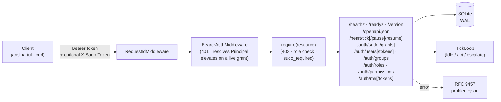
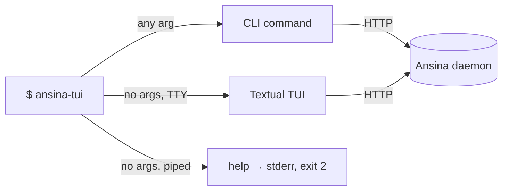

# 🫀 Ansina

[](https://github.com/giacchetta/ansina/actions/workflows/ci.yml)

> A self-owned AI agent: an always-on in-process **Heart** plus a remote **Brain**, exposed over a single internal REST API. No chat channels.

> **Status:** M4 — Ansina CLI/TUI complete (issues #30, #28, #31–#35): the `ansina-tui` control surface (TUI + CLI) over the REST API, self-service tokens, and the `me.*` self-resource policy class. M4 ran **before** M3 despite the number — see the [roadmap](docs/architecture/blueprint.md#4-roadmap). M2 (RBAC & Access Control) and M1 (Heart & Brain) landed before it.



## ⚡ Quick Start

```bash
make sync          # bootstraps uv if missing, installs dependencies
uv run ansina       # serves on http://127.0.0.1:8000
curl localhost:8000/healthz
```

First run prints a bootstrap Admin API token **once** — copy it now, it's never shown or stored in plaintext again:

```bash
uv run ansina        # look for the banner, then Ctrl-C
export TOKEN=<the token from the banner>
curl -H "Authorization: Bearer $TOKEN" localhost:8000/version
```

## 🖥️ Control surface (`ansina-tui`)

The curl ceremony above is exactly what `ansina-tui` replaces — one binary, two surfaces, over
the same REST API:



**The one rule to know:** bare `ansina-tui` opens the TUI; *any* argument at all — a
subcommand, `--help`, `--version` — is the CLI, never the TUI. Bare on a non-TTY prints help
to **stderr** and exits `2` (Textual can't render into a pipe).

```bash
uv tool install ./tui              # global `ansina-tui`
# or, without installing:
uv run --project tui ansina-tui
```

| Binary | From | What it is |
|---|---|---|
| `ansina` / `python -m ansina` | root project (unchanged by this milestone) | the daemon |
| `ansina-tui` / `python -m ansina_tui` | `tui/` | TUI (bare) / CLI (subcommands) |

| Command | Purpose | Example |
|---|---|---|
| `ansina-tui status` | health → readiness → version; works with **no token** | `ansina-tui status` |
| `ansina-tui auth …` | `login`/`status`/`logout`/`sudo`/`token mint\|list\|revoke` | `ansina-tui auth login --with-token < token.txt` |
| `ansina-tui api …` | raw REST wrapper reaching **every** route — the CI/CD surface | `ansina-tui api /auth/me \| jq .roles` |

Global options (`--host`, `--json`, `--verbose`, `--version`) are root-level, like `git`'s —
before the subcommand, not after. The TUI is **read-only** in M4: mutations stay on the CLI,
where confirmation and sudo prompting are unambiguous.

A credential lives in `~/.config/ansina/hosts.toml` at mode `0600` — **refused on read** if
group/world-readable. `ANSINA_TOKEN`/`ANSINA_HOST` override it for one invocation and are
never written back. A token or password is never a flag value or a bare argument, and there
is deliberately no `--show-token` — a newly minted token is shown exactly once.

| Exit code | Meaning |
|---|---|
| `0` | ok |
| `1` | request failed |
| `2` | usage error / local config problem |
| `3` | not authenticated (401) |
| `4` | forbidden / sudo required (403) |
| `5` | host unreachable |
| `6` | daemon reachable but not ready (`/readyz` 503) |
| `7` | daemon reachable but not healthy (`/healthz` ≠ 200) |

`/healthz` is always checked before `/readyz`, so an unhealthy daemon exits `7`, never `6`.
Full per-command detail (flags, `api`'s `-f`/`--input`/`-H` rules, config file layout): see
[`tui/README.md`](tui/README.md).

## 🔌 API

| Route | Auth | Min role | Purpose |
|---|---|---|---|
| `GET /healthz` | public | — | Liveness only — 200 unconditionally, never consults readiness. |
| `GET /readyz` | public | — | 200 `ready` with per-check booleans, or 503 `problem+json` if any check fails. |
| `GET /version` | token | Read | Name + version. |
| `GET /openapi.json` | token | Read | The OpenAPI contract document — no `/docs`/`/redoc` HTML viewer is served; point any external OpenAPI UI at a fetched copy of this JSON instead. |
| `GET /heart/tick` | token | Read | Tick loop status: running, paused, tick count, last decision. 503 `problem+json` if the Heart is disabled. |
| `POST /heart/tick/pause` | token | Write | Kill switch — halts future ticks without a process restart. |
| `POST /heart/tick/resume` | token | Write | Undoes `/heart/tick/pause`. |
| `POST /auth/sudo` | token | Maintain | Step up: re-verify your password, get back a short-lived sudo grant token. |
| `DELETE /auth/sudo` | token | Maintain | Revoke your own active sudo grant early. |
| `DELETE /auth/sudo/grants` | token (+ sudo for `Maintain`) | Maintain | Break-glass — revokes *every* user's active sudo grant. |
| `GET /auth/users`, `GET /auth/users/{id}` | token | Maintain | List/inspect users — `deleted_at` included for audit visibility. |
| `POST /auth/users` | token + sudo for `Maintain` | Maintain | Create a user (`username`, optional `display_name`/`password`). |
| `PATCH /auth/users/{id}` | token + sudo for `Maintain` | Maintain | Update `display_name`/`active`. Refused (409) if it would demote the last `Admin`. |
| `DELETE /auth/users/{id}` | token + sudo for `Maintain` | Maintain | One-way tombstone — see below. Refused (409) on the last `Admin`. |
| `PUT /auth/users/{id}/password` | token + sudo for `Maintain` | Maintain | Set/replace the user's password credential. |
| `POST /auth/users/{id}/tokens` | token + sudo for `Maintain` | Maintain | Issue the user's *first* API token — the raw value is returned **once**. 409 if they already hold one; beyond the first, the user mints their own via `POST /auth/me/tokens`. |
| `GET /auth/users/{id}/tokens` | token | Maintain | List a user's tokens — metadata only, never a hash/salt. |
| `DELETE /auth/users/{id}/tokens/{token_id}` | token + sudo for `Maintain` | Maintain | Revoke one of a user's tokens — the recovery path once their last one is revoked, `POST` can issue a fresh one again. |
| `GET /auth/groups`, `GET /auth/groups/{id}` | token | Maintain | List/inspect groups. |
| `POST /auth/groups` | token + sudo for `Maintain` | Maintain | Create a group (`slug`, `name`, optional `description`). |
| `PATCH /auth/groups/{id}` | token + sudo for `Maintain` | Maintain | Update `name`/`description`. |
| `DELETE /auth/groups/{id}` | token + sudo for `Maintain` | Maintain | Delete a group. Refused (409) if it's the last thing granting some user `Admin`. |
| `PUT`/`DELETE /auth/groups/{id}/members/{user_id}` | token + sudo for `Maintain` | Maintain | Add/remove a group member. |
| `POST`/`DELETE /auth/users/{id}/roles/{role_id}` | token + sudo for `Maintain` | Maintain | Attach/detach a role to a user — see the self-escalation and last-`Admin` rules below. |
| `POST`/`DELETE /auth/groups/{id}/roles/{role_id}` | token + sudo for `Maintain` | Maintain | Attach/detach a role to a group — same rules, applied to every current member. |
| `GET /auth/roles` | token | Maintain | The role catalog (builtin only in M2) with each role's current `role_permissions` grants. Read-only — no create/update/delete route exists. |
| `GET /auth/permissions` | token | Maintain | The full `(resource, verb)` catalog — the discovery surface a future custom-role editor builds on. |
| `GET /auth/me` | token | Read | The caller's own identity (user, roles, sudo status) — every role reaches this, never sudo-gated. See the `me.*` carve-out below. |
| `POST /auth/me/tokens` | token | Read | Mint your own API token — the raw value is returned **once**. Refused (403) for the bootstrap identity. |
| `GET /auth/me/tokens` | token | Read | List your own tokens — metadata only, never a hash/salt. |
| `DELETE /auth/me/tokens/{token_id}` | token | Read | Revoke one of your own tokens. Refused (403) for the bootstrap identity. |

`PUBLIC_PATHS` (`/healthz`, `/readyz`) is the only carve-out — every other route is deny-by-default at both layers: **authentication** (a valid bearer token identifying *some* user — 401 `problem+json`, `ansina.unauthorized`) and, per user role, **authorization** (that user's role holding a grant for this route's resource and HTTP verb — 403 `problem+json`, `ansina.forbidden`). Four fixed roles, increasing in scope: `Read` (GET only) → `Write` (+POST/PUT/PATCH) → `Maintain`/`Admin` (+DELETE and the RBAC management surface, `/auth/*`). A route with no `require(...)` authorization declaration fails to boot at all — the same "fail loudly before uvicorn binds a port" gate `HeartUnavailableError` uses — so a new endpoint can never ship ungated by accident. A third resource policy class, `me.*`, sits alongside these — every role holds every verb on it, since its subject is always the caller themselves; see the carve-out below.

Auth is enforced by default: on first boot Ansina *always* generates and prints its own bootstrap API token, assigned the `Admin` role — a permanent break-glass credential, never overridable and never rotated. Separately, setting `ANSINA_SECURITY__ADMIN_USERNAME` + `ANSINA_SECURITY__API_TOKEN` together provisions a second, ordinary Admin user once at first boot (the "configured admin") — the credential a scripted install or CI actually wants, since it never requires scraping the one-time banner off stdout. A missing/wrong token gets a 401. `ANSINA_SECURITY__ENABLED=false` disables both authentication and authorization entirely (loopback-only) for local dev — `/version` then returns 200 without a token.

**Sudo step-up**, mirroring Linux `sudo`: `Admin` and `Maintain` hold identical role grants, but any request touching the identity/access-control surface (an `auth.*` resource marked `sensitive=True`) additionally requires `Maintain` to present a live sudo grant — `Admin` never does. Get one via `POST /auth/sudo` (body: `{"password": "..."}`, re-verified against your own account), then present the returned `token` as `X-Sudo-Token` on the sensitive call; a missing, wrong, expired, or revoked grant answers 403 `ansina.auth.sudo_required` rather than a misleading 401 — your bearer token is still fine, you just haven't stepped up. Grants expire after `[security.sudo] ttl_seconds` (default 10 minutes) and can be revoked early via `DELETE /auth/sudo`; five consecutive failed step-up attempts lock further attempts out for `lockout_seconds`, answering 429 with a `Retry-After` header. Verification itself sits behind a pluggable `StepUpVerifier` port — M2 ships password only, a future second factor is a new verifier, not a rewrite of the grant/TTL/revocation machinery.

**User/Group/Role management** (issue #27) is the surface all of the above exists to protect, `Admin`/`Maintain` only. Three invariants are enforced server-side, not just documented:

- **Deleting a user is a one-way tombstone**, not a row removal: `DELETE /auth/users/{id}` sets `deleted_at`, deactivates the user, and purges its credentials, role assignments, group memberships, and any live sudo grant — in one transaction, so nothing survives that could authenticate or authorize again. The `users` row itself (and its identity record) is kept for audit attribution, and the username stays permanently reserved; no route ever clears `deleted_at`, so a hand-edited `active = 1` on a tombstoned row restores nothing.
- **No caller can grant a permission it does not itself effectively hold.** Assigning a role checks, in order: only `Admin` may assign the `admin` role or any role carrying an `auth.*` permission (`Maintain` never can, sudo grant or not — under M2's fixed policy `Maintain` and `Admin` hold identical `role_permissions` rows, so this is checked directly rather than left to a subset comparison); and, generally, a role's whole grant set must already be a subset of the caller's own. A violation is 403 `ansina.auth.self_escalation`.
- **The last remaining `Admin` can never lose that role** — deleting, deactivating, or demoting (directly or via a group) the sole holder of `admin` is refused with 409 `ansina.auth.last_admin`.

Roles themselves are read-only over this API (`GET /auth/roles`): builtin-role grants are owned by the reconciler that seeds them at every boot, and creating/editing/deleting roles (custom or builtin) is out of scope for M2, deferred to a follow-up milestone that builds write routes on the same tables `GET /auth/roles`/`GET /auth/permissions` already expose.

**The `me.*` self-resource carve-out** (issue #30): `auth.policy.permitted_verbs` grants every verb on any `me.*` resource to every builtin role, `Read` included — the one exception to the `auth.*` "Maintain/Admin only" rule above. This is not an escalation: the subject of a `me.*` action is always the authenticated caller themselves, so no `me.*` route can reach another user's data, by construction. `GET /auth/me` returns the already-resolved `Principal` with no extra database read; `me.tokens` (issue #28) builds on the same prefix for self-service API tokens — mint, list, revoke your own, no Admin hand-holding required. The one caller refused on `me.tokens` regardless of role is the bootstrap identity itself, which holds exactly one token, ever, managed only by `bootstrap_admin_enabled`.

## ⚙️ Configuration

Precedence: built-in defaults → `ansina.toml` → `ANSINA_*` env vars. Secrets are env-only — setting `ANSINA_SECURITY__API_TOKEN` in `ansina.toml` is a hard startup error. See [`ansina.example.toml`](ansina.example.toml) for the full shape.

## 🫀 Heart runtime

The in-process Heart (`[heart] enabled`, off by default) currently runs on **MLX only — Apple Silicon**. Enable it:

```bash
uv sync --extra mlx
ANSINA_HEART__ENABLED=true uv run ansina
```

On any other host, enabling it fails loudly at boot rather than silently degrading — no fallback ships yet (a portable, non-Apple-Silicon adapter is tracked in a follow-up issue).

Once loaded, the Heart runs an autonomic tick loop (`[heart.tick]`, on by default whenever the Heart is): every `interval_seconds` (plus jitter) it decides idle/act/escalate and logs the decision. `act` and `escalate` are logged only for now — there's nothing to act on yet and no `BrainProvider` (issue #12) to escalate to. `GET /heart/tick` reports its state; `POST /heart/tick/pause` and `/resume` are the kill switch.

## 🛠️ Development

| Target | Runs |
|---|---|
| `make sync` | Install/sync dependencies via `uv` |
| `make check` | Everything CI runs: lint, format-check, mypy --strict, full test suite |
| `make test-unit` | Unit tests only |
| `make test-e2e` | Black-box E2E suite (real subprocess) |
| `make precommit` | Pre-commit hooks against all files |
| `make tui-check` | Everything the `tui` CI job runs (`tui/`: lint, format-check, mypy --strict, tests) |
| `make check-all` | Both the daemon's `check` and `tui-check` |

## 📚 Docs

[`docs/architecture/blueprint.md`](docs/architecture/blueprint.md) — architecture rationale, the OpenClaw comparison this design departs from, and the full roadmap.
[`tui/README.md`](tui/README.md) — the `ansina-tui` control surface: every command, flag, and config file in full.
