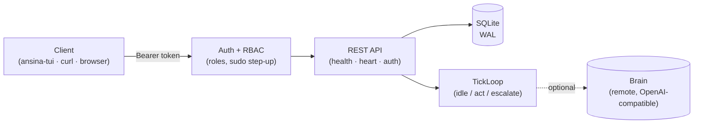

# 🫀 Ansina

[](https://github.com/giacchetta/ansina/actions/workflows/ci.yml)

> A self-owned AI agent: an always-on in-process **Heart** plus a remote **Brain**, exposed over a single internal REST API. No chat channels.


```mermaid
flowchart LR
    Client["Client\n(ansina-tui · curl · browser)"] -->|Bearer token| Auth["Auth + RBAC\n(roles, sudo step-up)"]
    Auth --> Routes["REST API\n(health · heart · auth)"]
    Routes --> DB[("SQLite\nWAL")]
    Routes --> Tick["TickLoop\n(idle / act / escalate)"]
    Tick -.optional.-> Brain[("Brain\n(remote, OpenAI-compatible)")]
```

## ⚡ Quick Start

```bash
make sync          # bootstraps uv if missing, installs dependencies
uv run ansina       # serves on http://127.0.0.1:8000
curl localhost:8000/healthz
```

First run prints a bootstrap Admin API token **once** — copy it now, it's never shown or stored in plaintext again:

```bash
uv run ansina        # look for the banner, then Ctrl-C
export TOKEN=<the token from the banner>
curl -H "Authorization: Bearer $TOKEN" localhost:8000/version
```

## 🔐 Auth

Every route except `/healthz`/`/readyz`/the login routes requires a bearer token
(`Authorization: Bearer ...`) identifying a user with a role granting that route.
Four fixed roles, increasing in scope: `Read` → `Write` → `Maintain`/`Admin`.

A handful of sensitive actions (user/role management) additionally require a short-lived
**sudo grant**, mirroring Linux `sudo`:

```bash
curl -X POST -H "Authorization: Bearer $TOKEN" -d '{"password": "..."}' localhost:8000/auth/sudo
# -> {"token": "...", "expires_at": "..."}
# then present it on the sensitive call:
curl -H "Authorization: Bearer $TOKEN" -H "X-Sudo-Token: <that token>" ...
```

Password login (`POST /auth/login`), OIDC federated login, TOTP second-factor step-up,
and CORS for browser-hosted clients are all supported, each off or gated behind its own
config flag — see [`docs/architecture/blueprint.md`](docs/architecture/blueprint.md#identity--access-control)
for how and why. The full route-by-route contract is `GET /openapi.json` (point any
OpenAPI UI at a fetched copy — no `/docs`/`/redoc` HTML viewer is served) or
[`tui/README.md`](tui/README.md) for the CLI's own per-command breakdown.

## 🖥️ Control surface (`ansina-tui`)

One binary, two surfaces, over the same REST API: bare `ansina-tui` opens a Textual
TUI; any argument — a subcommand, `--help` — makes it a CLI instead.

```bash
uv tool install ./tui              # global `ansina-tui`
ansina-tui status                  # health → readiness → version, no token needed
ansina-tui auth login --with-token < token.txt
ansina-tui api /auth/me | jq .roles
```

See [`tui/README.md`](tui/README.md) for every command, flag, exit code, and the
config file layout.

## ⚙️ Configuration

Precedence: built-in defaults → `ansina.toml` → `ANSINA_*` env vars. Secrets are
env-only — setting `ANSINA_SECURITY__API_TOKEN` in `ansina.toml` is a hard startup
error. See [`ansina.example.toml`](ansina.example.toml) for the full shape.

## 🫀 Heart runtime

The in-process Heart (`[heart] enabled`, off by default) currently runs on **MLX
only — Apple Silicon**:

```bash
uv sync --extra mlx
ANSINA_HEART__ENABLED=true uv run ansina
```

On any other host, enabling it fails loudly at boot rather than silently degrading.
For the Mac Mini M4 deployment target specifically,
[`docs/heart/mac-mini-m4.toml`](docs/heart/mac-mini-m4.toml) is a complete,
copy-to-`ansina.toml` profile with every validated `[heart]`/`[heart.tick]`/
`[heart.journal]` value, annotated with the measurement behind it.

Once loaded, the Heart runs an autonomic tick loop (`[heart.tick]`): every
`interval_seconds` it decides idle/act/escalate. `GET /heart/tick` reports its
state; `POST /heart/tick/pause`/`/resume` is the kill switch; `GET /heart/journal`
is a durable, readable trace of every past decision. `[heart.tick] escalate_to_brain`
(default `false`) additionally wires an `escalate` decision to a real `BrainProvider`
call (`[brain]`, below) — `false` is a verified no-op either way.

The remote **Brain** (`[brain] enabled`, off by default) is a 35B+ model reached
through any OpenAI-compatible endpoint — configure `[brain] base_url`/`api_key`/
`model`. It owns all real reasoning; the Heart never answers for it.

## 🧪 Dev tooling

- [`docs/heart/bench.md`](docs/heart/bench.md) — run the Heart decision-accuracy
  bench against a real model (`make heart-bench`/`make remote-heart`), and where
  reports end up (a durable S3-compatible bucket, `make heart-bench-publish`).
- [`docs/heart/soak.md`](docs/heart/soak.md) — run the tick loop unattended for
  hours on real hardware and measure steady-state behavior.
- [`docs/dev-mode.md`](docs/dev-mode.md) — `ansina --dev`: auto-ship the daemon's
  own telemetry to the report bucket via a supervised Vector sidecar.

```bash
make check         # everything CI runs: lint, format-check, mypy --strict, full test suite
make check-all      # the above, plus tui/'s own check suite
```

Run `make help` for the full target list.

## 📚 Docs

- [`docs/architecture/blueprint.md`](docs/architecture/blueprint.md) — architecture rationale, the OpenClaw comparison this design departs from, and the full roadmap.
- [`tui/README.md`](tui/README.md) — the `ansina-tui` control surface: every command, flag, and config file in full.
- [`docs/heart/bench.md`](docs/heart/bench.md) / [`docs/heart/soak.md`](docs/heart/soak.md) / [`docs/dev-mode.md`](docs/dev-mode.md) — Heart bench/soak tooling and Dev Mode.
- [`docs/ml/corpus-contract.md`](docs/ml/corpus-contract.md) — the versioned schema for every bucket artifact family (bench report, soak run, telemetry sample, mirrored log line).
