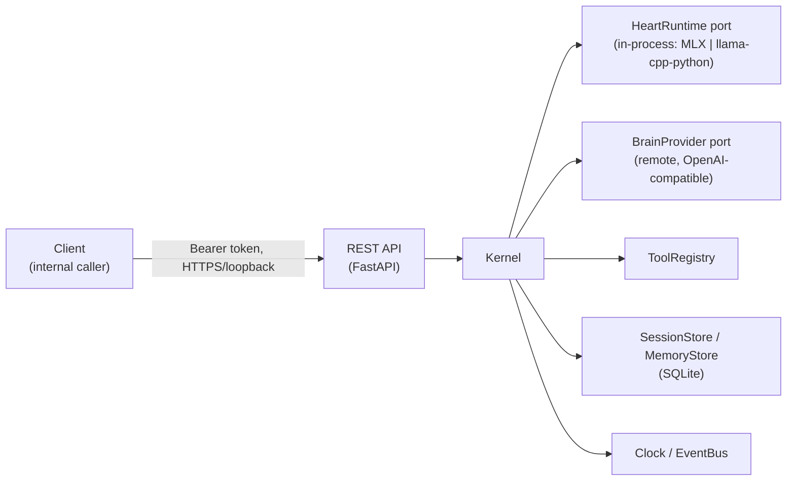
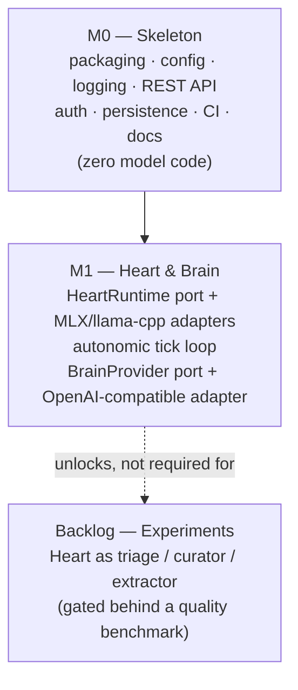

# Ansina — Architecture Blueprint

This document distills the OpenClaw codebase (vendored locally at `openclaw-main/`, not tracked by this repo — see `.gitignore`) into a class/function inventory, states what Ansina deliberately takes and refuses from it, and lays out Ansina's own target architecture. It is the primary input for `AGENTS.md` Layer 5 and for every M0/M1 issue.

Ansina is a new, self-owned AI agent replacing day-to-day reliance on OpenClaw. OpenClaw is broad (≈2,900 non-test TypeScript files across `src/` plus 23 workspace packages) and permanently in beta. Ansina trades that breadth for a small, boring, provable core.

| | OpenClaw | Ansina |
|---|---|---|
| Runtime | Node.js / TypeScript | Python ≥ 3.14 |
| Surface | 20+ chat channels + WS gateway + Control UI | One internal REST API. No channels. |
| Models | Cloud providers only | Embedded "Heart" model in-process + remote "Brain" |
| Scale | 158 plugins, 366 RPC methods, ~130 SQLite tables | Small, boring, provable |

---

## §1 OpenClaw structural inventory

Class/function names and file paths only — no parameters, no exhaustive coverage. Paths are relative to `openclaw-main/`.

### Agent loop — `packages/agent-core/`

The path from "user turn" to "model call" to "tool execution" to "repeat":

```
Agent.prompt (agent.ts)
  → runAgentLoop (agent-loop.ts)
    → runLoop                       # THE loop: outer = follow-ups, inner = tool-call cycles
      → streamAssistantResponse     # build context → call model → fold stream into AssistantMessage
      → executeToolCalls            # sequential or parallel batch executor
        → resolveToolCallTool → prepareToolCall → tool.execute(...) → createToolResultMessage
      → prepareNextTurn / shouldStopAfterTurn
```

| Symbol | File | Purpose |
|---|---|---|
| `runLoop`, `runAgentLoop`, `runAgentLoopContinue` | `agent-loop.ts` | The main loop and its two entry modes (new turn vs. resume). |
| `streamAssistantResponse` | `agent-loop.ts` | Applies context transforms, resolves auth, calls the model, folds deltas. |
| `executeToolCalls`, `executeToolCallsSequential`, `executeToolCallsParallel` | `agent-loop.ts` | Tool batch execution, two strategies. |
| `class Agent`, `Agent.prompt`, `Agent.continue`, `Agent.steer` | `agent.ts` | Stateful wrapper: owns messages/model/tools, queues, abort controller. |
| `class PendingMessageQueue` | `agent.ts` | Steering/follow-up message queue. |
| `AgentMessage`, `AgentContext`, `AgentState`, `AgentTool`, `AgentEvent` | `types.ts` | Core data model (see §1 data types below). |

### Sessions — `src/agents/sessions/`, `src/config/sessions/`

`class AgentSession` (mixin chain: Base → Prompting → Tree → …) wraps one agent-core `Agent` plus one `class SessionManager`. **The transcript is a tree, not a list** — `SessionEntry` union with parentId + leaf pointer + branches — persisted to SQLite (`session_nodes`, `transcript_events`, …) with a JSONL mirror for import/export. This is the single biggest structural idea worth stealing: branch-and-summarize instead of linear truncation.

### Context assembly & compaction — `src/context-engine/`

```ts
interface ContextEngine {
  bootstrap?, ingest, ingestBatch?, afterTurn?, commitTurn?,
  assemble,   // → AssembleResult { messages, estimatedTokens, systemPromptAddition?, ... }
  compact,    // → CompactResult
  maintain?, prepareSubagentSpawn?, onSubagentEnded?, dispose?
}
```

Pluggable via a registry (`resolveContextEngine`); a `LegacyContextEngine` no-op is the default. Built-in compaction (`packages/agent-core/src/harness/compaction/compaction.ts`): `shouldCompact` → `findCutPoint` → `prepareCompaction` → `generateSummary` → `compact`.

### Tools — `packages/agent-core/src/types.ts`, `src/agents/tools/`

```ts
interface AgentTool {
  name, label, description, parameters,  // TypeBox schema — described to the model
  execute(toolCallId, args, onUpdate, signal) → AgentToolResult
}
```

**Multi-stage approval layer**, not a single gate:
1. Static allow/deny policy (`tool-policy.ts`) — `collectExplicitAllowlist/Denylist`.
2. Policy pipeline (`tool-policy-pipeline.ts`) — scoped by session/sender/sandbox.
3. Per-call `before_tool_call` hook (`agent-tools.before-tool-call.*`) — can block or defer to human approval.
4. Bash-specific exec approvals (`bash-tools.exec-approval-*.ts`).
5. Durable operator approvals stored in SQLite (`operator_approvals`, `exec_approvals_config`).

### LLM abstraction — `packages/llm-core/`, `packages/ai/`

```ts
interface ApiProvider<TApi> { api, stream, streamSimple }
type StreamFunction = (model, context, options) => AssistantMessageEventStreamContract
```

**The load-bearing rule**: `stream` must return synchronously and **never throw after invocation** — every failure is encoded as a terminal `error` event on the stream, not a thrown exception. Event union: `start | text_delta | thinking_delta | toolcall_delta | done | error`. One adapter per API family (Anthropic, OpenAI completions/responses, Google, Mistral, Azure...), registered lazily into a `createApiRegistry()`.

### Model catalog & fallback — `packages/model-catalog-core/`, `src/agents/`

`ModelCatalogModel` (cost, contextWindow, compat flags) → `normalizeModelCatalog` → `resolveModelCandidateChain` → `runWithModelFallback` → `classifyFailoverReason` (auth / overloaded / context_overflow / …) drives auth-profile rotation, then model fallback, then bounded whole-chain retry.

### The "utility model" — `src/agents/utility-model.ts`

`resolveUtilityModelRefForAgent()` picks a provider-declared cheap model (e.g. `claude-haiku-4-5`) used for session titles, tool-call purpose titles, progress narration, and session digests, with automatic fallback to the primary model. **This is OpenClaw's closest analogue to Ansina's Heart** — worth naming explicitly, because Ansina inverts the relationship: OpenClaw's cheap model does opportunistic text tasks; Ansina's Heart does none of that (see §3) and instead owns the always-on liveness loop.

### Service layer — `src/gateway/`, `src/config/`, `src/cron/`, `src/process/`

- `createGatewayHttpServer()` (`server-http.ts`) — hand-rolled route table over `node:http`, not Express/Fastify. Primary surface is actually a framed WebSocket protocol (`packages/gateway-protocol`, TypeBox schemas, ~366 RPC methods), REST is secondary (`/v1/models`, `/v1/chat/completions`, `/tools/invoke`).
- Config: Zod v4, layered `defaults → $include files → main file → ${ENV} substitution → env vars`, fail-fast validation (`src/config/io.load.ts`).
- `class CronService`, `createProcessSupervisor()` — scheduling and child-process lifecycle.
- Structured logging (`src/logging/`) treats **redaction as first-class**: every formatter path runs through `redactSensitiveText`/`redactToolPayloadText`, not bolted on later.

---

## §2 What Ansina takes, and what it refuses

**Takes:**
- The provider-port shape (`ApiProvider { stream }`) and its never-throw-after-invocation rule for streaming.
- The tool contract (`name/description/parameters/execute`) plus a real approval gate — even a single-stage one in M0.
- Session-as-tree, deferred to a later milestone, but named now so early schema choices don't foreclose it.
- The `ContextEngine` seam (`ingest`/`assemble`/`compact`) as a named interface even before it has more than one implementation.
- Layered config with env substitution and fail-fast validation.
- Structured logging with redaction built into the formatter, not added after a leak.

**Refuses:**
- **Channels.** `src/channels` is 261 non-test files and its `ChannelId` type bleeds into 62 files under `src/agents`, into cron (`CronDelivery.channel`), into the config schema, and into the published wire protocol. Removing it post-hoc would break delivery, cron, health reporting, and the protocol simultaneously. This is the concrete cautionary tale: Ansina has **zero** channel concept anywhere, including in naming — there is no `ChannelId`-shaped placeholder to tempt future scope creep.
- The plugin mega-surface (~60 `api.register*` extension points, ~45 lifecycle hooks, 158 bundled plugins).
- The WS gateway + Control UI + MCP-server-hosting layer.
- Worker/node distribution (`src/worker`, `src/gateway/worker-environments`).
- The ~130-table shared state DB. Ansina starts with one table (`schema_version`) and grows it deliberately.

---

## §3 Ansina target architecture

Hexagonal: one HTTP surface, one kernel, named ports, adapters landed only as their milestone arrives.



### The Heart/Brain contract

The **Heart** is a ≤4B-parameter, 8k-context model running **in-process** (no subprocess, no HTTP hop — MLX on Apple Silicon primary, `llama-cpp-python` fallback) as an always-on autonomic tick loop. Its day-one job is narrow and explicit: **decide idle vs. act vs. escalate**, nothing else. It does not answer user requests, does not summarize, does not route. Every prompt the Heart ever sees must fit comfortably inside 8k tokens — that is a hard constraint, not a target, because the model quality at 4B does not tolerate a crowded context.

The **Brain** is a 35B+ model reached through a `BrainProvider` port, cloud-backed by default (OpenAI-compatible adapter), with a local adapter possible later. All real reasoning happens here. The Heart never replaces it.

Three additional Heart duties — request triage, context curation, structured extraction — are deliberately **not** implemented yet. The user has been burned before by low-quality small-model output; each duty is tracked as a gated experiment (see the Backlog milestone) that must beat a stated baseline before being adopted, not adopted on vibes.

### Primary target hardware

Mac Mini 2024, Apple M4, 16 GB unified memory — this is the deployment target and it shapes the adapter priority (MLX first). The Fedora/AMD-RX580 development machine is incidental and must not shape design decisions.

---

## §4 Roadmap



M0 exit criterion: `uv run ansina` serves an authenticated REST API with health probes, structured logs, and a migrated SQLite database, green on CI for Linux and macOS-arm64, with zero model code.

Tracking issues live in GitHub milestones `M0 — Skeleton`, `M1 — Heart & Brain`, `Backlog — Experiments`.

---

## §5 Testing strategy

Two layers, mirroring the unit/E2E split familiar from Jest-based JS projects — `pytest` fixtures (`conftest.py`) are the direct analogue of Jest fixture files, with dependency-injected scoping rather than imports.

- **Unit tests** (`tests/unit/`) mirror `src/ansina/` 1:1. Every public function/method gets a direct test, not just incidental coverage through higher-level tests. A coverage threshold is enforced in CI — dropping below it fails the build, not just the report.
- **E2E tests** (`tests/e2e/`) are black-box: they launch `python -m ansina` as a real subprocess against a temp config and temp SQLite file, and talk to it only over HTTP — never by importing app internals. This is the gate that answers "does a fresh build actually work," independent of whether the unit tests pass. M0 coverage: boot + readiness, health/version, auth enforcement (401 then 200), and migration state. Each later milestone's issues extend this suite rather than growing a separate one.

CI (`M0` issue for the workflow) runs unit tests and the E2E suite as two distinct jobs, both required, on both OS legs (`ubuntu-latest`, `macos-14`).
