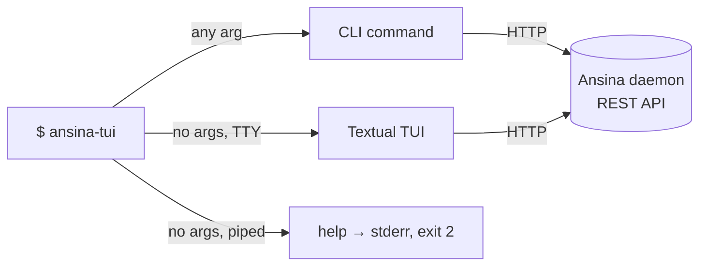

# ansina-tui

The control surface for [Ansina](../README.md): one binary that is a **Textual TUI** when
launched bare, and a **scriptable CLI** the moment you give it any argument at all — a
subcommand, `--help`, `--version`. It talks to the daemon over its REST API only; this project
never imports `ansina`.



## Install

```bash
uv sync --project tui          # from the repo root
# or, from inside tui/
uv sync
```

## Run

```bash
uv run --project tui ansina-tui              # bare → opens the TUI
uv run --project tui ansina-tui status       # CLI → health/readiness/version
uv run --project tui ansina-tui --help       # CLI help, stdout, never the TUI
```

## `status`

The day-0 smoke test: `GET /healthz` → `GET /readyz` → `GET /version`, rendered as a table.
Works with **no token at all** — both health routes are public on the daemon.

```bash
ansina-tui status
ansina-tui --json status | jq .
```

Global options (`--host`, `--json`, `--verbose`, `--version`) are root-level, like `git`'s or
`docker`'s — they go **before** the subcommand, not after.

## `auth`

Store a credential once, see who you are, mint/rotate your own tokens, and step up to sudo —
without ever hand-assembling a header or pasting a grant token between commands.

```bash
ansina-tui auth login --with-token < token.txt   # or pipe/paste one, or a no-echo prompt
ansina-tui auth status                           # host, identity, roles, sudo state
ansina-tui auth token mint --label laptop        # shown once, then never again
ansina-tui auth token list                       # metadata only — never a secret
ansina-tui auth token revoke <id>
ansina-tui auth sudo                             # no-echo password prompt or stdin
ansina-tui auth sudo --status                    # local only, never touches the daemon
ansina-tui auth sudo --revoke
ansina-tui auth logout                           # local only — see below
```

A token or password is **never** a flag value or a bare argument — only `--with-token`
(reading stdin), a piped stdin, or a no-echo prompt. `auth logout` drops the local credential
and any sudo grant but does **not** revoke the token server-side (a token you log out of on one
machine may still be in use on another) — `auth token revoke` is the server-side action, and it
warns before revoking the token currently in use as this host's own credential.

Two identities need special handling, both from issue #28: the **bootstrap identity** (the
one-time banner token printed at first boot) is a break-glass credential capped at exactly one
token, ever — `auth token mint`/`revoke` against it renders a 403 explaining the real fix (log
in as the configured admin or an ordinary Admin instead). The **configured admin**
(`ANSINA_SECURITY__ADMIN_USERNAME`/`API_TOKEN`) is an ordinary user — `auth token mint`/`revoke`
*is* its documented credential-rotation recipe. `auth token list`'s `last_used_at` is coalesced
server-side (`[security] token_last_used_resolution_seconds`, default 300s) and can lag actual
use by a few minutes.

## Exit codes

Pinned by test (`tests/unit/test_exits.py`) — safe to script against.

| code | meaning |
|---|---|
| `0` | ok |
| `1` | request failed |
| `2` | usage error / local config problem (e.g. an insecure `hosts.toml`) |
| `3` | not authenticated (daemon returned 401) |
| `4` | forbidden / sudo required (daemon returned 403) |
| `5` | host unreachable |
| `6` | daemon reachable but not ready (`/readyz` reports 503) |
| `7` | daemon reachable but not healthy (`/healthz` did not return 200) |

`/healthz` is checked before `/readyz`, so an unhealthy daemon always exits `7`, never `6`.

## Config & credentials

`~/.config/ansina/` (or `$XDG_CONFIG_HOME/ansina`):

- `config.toml` — non-secret (`default_host`).
- `hosts.toml` — per-host token, cached identity, live sudo grant. Written at mode `0600`;
  **refused on read** if it's group- or world-readable, with a message naming the fix
  (`chmod 600 …`). There is deliberately no `--show-token` — a token is shown once, at mint time.

`ANSINA_TOKEN` / `ANSINA_HOST` override the file for one invocation and are never written back.

## Output discipline

Human-readable tables by default. With `--json`, stdout carries JSON and **nothing else** —
every diagnostic goes to stderr — so the CLI is safe to pipe.

## Isolation

`tui/` is a standalone project: its own `pyproject.toml`, `uv.lock`, `.venv`, CI job. It never
imports `ansina` — only HTTP, exactly like any third-party client. `tests/unit/test_isolation.py`
pins this: after a full CLI run, no `ansina`/`ansina.*` module is in `sys.modules`.

## Development

```bash
make tui-check      # from the repo root: ruff, ruff format --check, mypy --strict, pytest @ 100%
```
