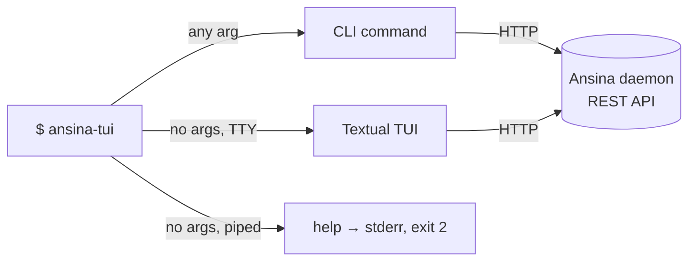

# ansina-tui

The control surface for [Ansina](../README.md): one binary that is a **Textual TUI** when
launched bare, and a **scriptable CLI** the moment you give it any argument at all — a
subcommand, `--help`, `--version`. It talks to the daemon over its REST API only; this project
never imports `ansina`.



## Install

```bash
uv sync --project tui          # from the repo root
# or, from inside tui/
uv sync
```

## Run

```bash
uv run --project tui ansina-tui              # bare → opens the TUI
uv run --project tui ansina-tui status       # CLI → health/readiness/version
uv run --project tui ansina-tui --help       # CLI help, stdout, never the TUI
```

## TUI (bare invocation)

Bare `ansina-tui` on a TTY opens a tabbed Textual app with one tab, **Overview**: host,
`/healthz`, `/readyz` per-check rows, `/version`, and your identity from `GET /auth/me`,
refreshed on a timer (`--refresh` seconds, default `5`) and immediately on `r`. `q` quits.

The header always shows the host and connection state, and every daemon hiccup renders as a
designed message, never a traceback: host unreachable, no credential stored (names
`auth login`), a rejected token, an insufficient role, or a not-ready daemon all show up as
plain text or a per-check table in the relevant section instead of crashing the app.

The TUI is **read-only** in M4 — no pause/resume, no user/role management. Mutating actions
stay on the CLI (`api`, or a future dedicated subcommand), where confirmation and sudo
prompting are unambiguous.

```bash
ansina-tui                        # bare, on a TTY → the TUI
ansina-tui --refresh 10           # slower Overview refresh
ansina-tui --host http://x:8000   # against a specific daemon
```

## `status`

The day-0 smoke test: `GET /healthz` → `GET /readyz` → `GET /version`, rendered as a table.
Works with **no token at all** — both health routes are public on the daemon.

```bash
ansina-tui status
ansina-tui --json status | jq .
```

Global options (`--host`, `--json`, `--verbose`, `--version`) are root-level, like `git`'s or
`docker`'s — they go **before** the subcommand, not after. `--refresh` is TUI-only (there is no
subcommand of its own to carry it under the no-args rule) and is otherwise ignored.

## `auth`

Store a credential once, see who you are, mint/rotate your own tokens, and step up to sudo —
without ever hand-assembling a header or pasting a grant token between commands.

```bash
ansina-tui auth login --with-token < token.txt   # or pipe/paste one, or a no-echo prompt
ansina-tui auth status                           # host, identity, roles, sudo state
ansina-tui auth token mint --label laptop        # shown once, then never again
ansina-tui auth token mint --label ci --no-store # print it, but don't store it here
ansina-tui auth token list                       # metadata only — never a secret
ansina-tui auth token revoke <id>
ansina-tui auth token revoke <id> --yes          # skip the in-use confirmation
ansina-tui auth sudo                             # no-echo password prompt or stdin
ansina-tui auth sudo --status                    # local only, never touches the daemon
ansina-tui auth sudo --revoke
ansina-tui auth logout                           # local only — see below
```

A token or password is **never** a flag value or a bare argument — only `--with-token`
(reading stdin), a piped stdin, or a no-echo prompt. `auth logout` drops the local credential
and any sudo grant but does **not** revoke the token server-side (a token you log out of on one
machine may still be in use on another) — `auth token revoke` is the server-side action, and it
warns before revoking the token currently in use as this host's own credential (`--yes` skips
that confirmation, e.g. for scripting). `auth sudo --revoke` and `--status` are mutually
exclusive (exit `2` together). Bare `auth` or `auth token` with no subcommand is a usage error
(exit `2`), not silent success.

`auth login`'s first success on a fresh install also sets `config.toml`'s `default_host`, so
every later command can omit `--host`. `auth logout` is local-only; if `ANSINA_TOKEN` is set in
the environment it warns that logout can't unset it — unset the variable yourself for a shell to
be fully logged out.

`auth token mint`'s `--store`/`--no-store` decides whether the freshly minted token becomes this
host's active credential: pass one explicitly to skip the prompt (useful for scripting/CI, where
`--no-store` is also what a non-interactive run defaults to); omitted and interactive, it asks
before storing.

Two identities need special handling, both from issue #28: the **bootstrap identity** (the
one-time banner token printed at first boot) is a break-glass credential capped at exactly one
token, ever — `auth token mint`/`revoke` against it renders a 403 explaining the real fix (log
in as the configured admin or an ordinary Admin instead). The **configured admin**
(`ANSINA_SECURITY__ADMIN_USERNAME`/`API_TOKEN`) is an ordinary user — `auth token mint`/`revoke`
*is* its documented credential-rotation recipe. `auth token list`'s `last_used_at` is coalesced
server-side (`[security] token_last_used_resolution_seconds`, default 300s) and can lag actual
use by a few minutes.

## `api`

`curl` ergonomics without the `curl` ceremony: reach **any** daemon route with no per-route
special-casing and no allow-list to keep in sync — a route added by a later milestone is
reachable the day it merges. This is also the milestone's CI/CD surface, so it never blocks for
input: a sensitive route with no live sudo grant fails fast with a hint, it does not prompt.

```bash
ansina-tui api /version                              # GET, authenticated automatically
ansina-tui api /version | jq .                        # raw JSON, pipes cleanly
ansina-tui api -i /healthz                             # status line + response headers
ansina-tui api -X POST /heart/tick/pause               # explicit method
ansina-tui api -f username=bob -f password=hunter2 /auth/users   # -f body -> POST by default
echo '{"active": false}' | ansina-tui api -X PATCH /auth/users/<id> --input -
ansina-tui --json api /auth/me | jq .roles              # a non-2xx body pipes into jq too
```

Method defaults to `GET`, or `POST` when a body is supplied (`-f`/`--input`) — the `gh api`
convention. `-f/--field key=value` is repeatable and assembled into a JSON object body; its
values are **always JSON strings** — for a typed field (a boolean, a number, a nested object),
build the body yourself and send it with `--input <file|->` instead. `-f` and `--input` are
mutually exclusive (exit 2 together). `-H/--header 'Name: value'` is repeatable and merges over
the auth headers the client attaches — it can **never** replace `Authorization` or
`X-Sudo-Token`; a colliding `-H` is warned about, not silently dropped.

Output: pretty-printed JSON on a TTY with no `--json`; raw (exactly as the daemon sent it) under
`--json` or a piped stdout — so `--json | jq` and a plain pipe both carry the body and nothing
else, on a non-2xx response too. `-i/--include` prepends the status line and response headers,
and is itself suppressed under `--json`/piped stdout, same as every other human-only rendering.

Auth is automatic: the stored bearer token, and a live sudo grant's `X-Sudo-Token` whenever one
is stored (see `auth sudo` above) — the sudo dance (`POST /auth/sudo`, extract the grant, paste
it into the next call) disappears entirely. A 403 `ansina.auth.sudo_required` prints the
`auth sudo` hint and exits 4; it never prompts for a password mid-request.

Out of scope, deliberately: client-side validation of paths/bodies/verbs against the OpenAPI
document (the server is the authority), response filtering/pagination/templating, and dedicated
`heart`/`user`/`group`/`role` subcommands — everything above is already reachable through `api`.

## Exit codes

Pinned by test (`tests/unit/test_exits.py`) — safe to script against.

| code | meaning |
|---|---|
| `0` | ok |
| `1` | request failed |
| `2` | usage error / local config problem (e.g. an insecure `hosts.toml`) |
| `3` | not authenticated (daemon returned 401) |
| `4` | forbidden / sudo required (daemon returned 403) |
| `5` | host unreachable |
| `6` | daemon reachable but not ready (`/readyz` reports 503) |
| `7` | daemon reachable but not healthy (`/healthz` did not return 200) |

`/healthz` is checked before `/readyz`, so an unhealthy daemon always exits `7`, never `6`.

## Config & credentials

`~/.config/ansina/` (or `$XDG_CONFIG_HOME/ansina`):

- `config.toml` — non-secret (`default_host`).
- `hosts.toml` — per-host token, cached identity, live sudo grant. Written at mode `0600`;
  **refused on read** if it's group- or world-readable, with a message naming the fix
  (`chmod 600 …`). There is deliberately no `--show-token` — a token is shown once, at mint time.

`ANSINA_TOKEN` / `ANSINA_HOST` override the file for one invocation and are never written back.

## Output discipline

Human-readable tables by default. With `--json`, stdout carries JSON and **nothing else** —
every diagnostic goes to stderr — so the CLI is safe to pipe.

## Isolation

`tui/` is a standalone project: its own `pyproject.toml`, `uv.lock`, `.venv`, CI job. It never
imports `ansina` — only HTTP, exactly like any third-party client. `tests/unit/test_isolation.py`
pins this: after a full CLI run, no `ansina`/`ansina.*` module is in `sys.modules`.

## Development

```bash
make tui-check      # from the repo root: ruff, ruff format --check, mypy --strict, pytest @ 100%
```
